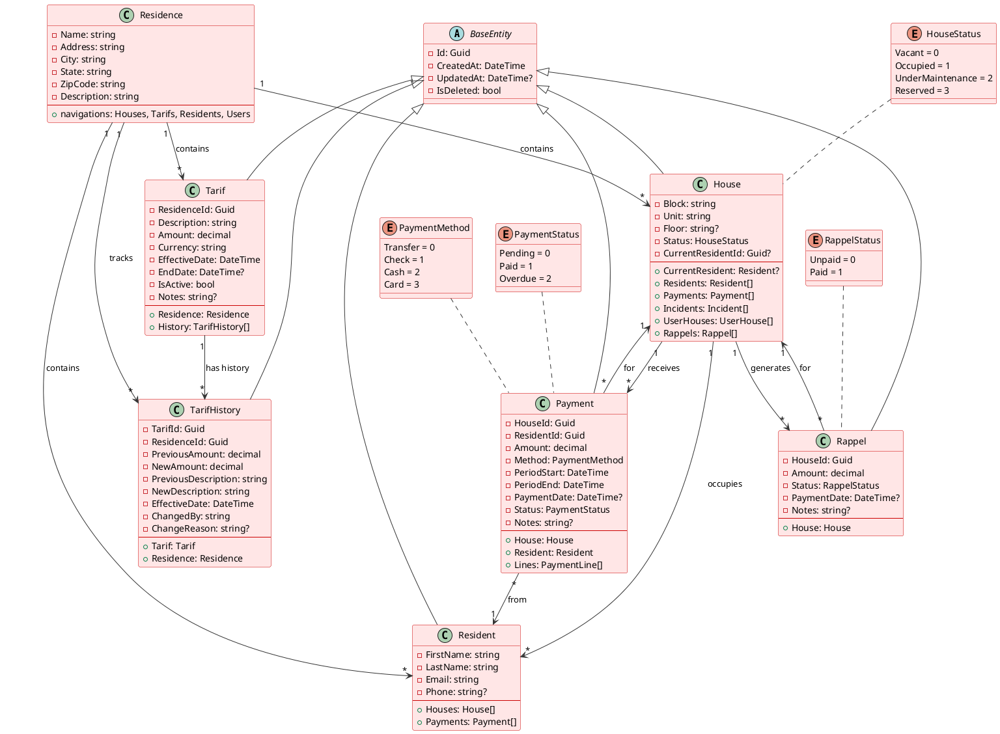
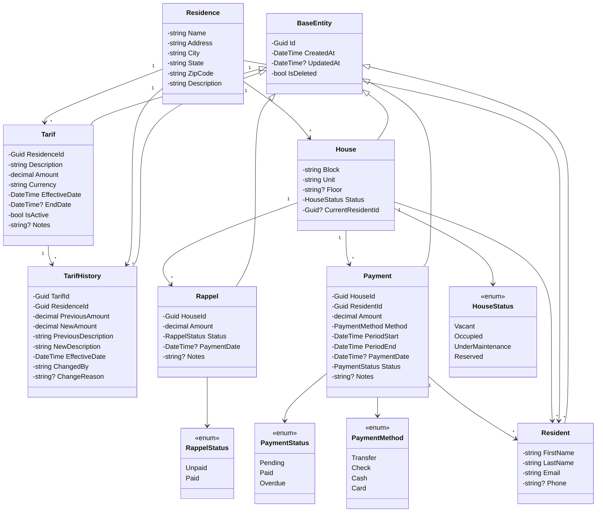
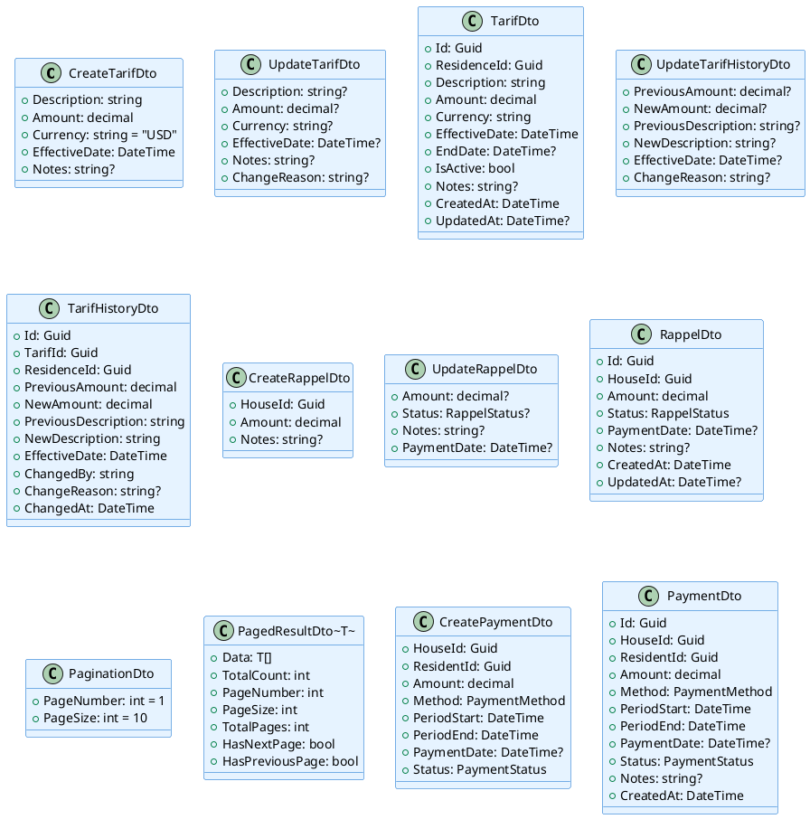
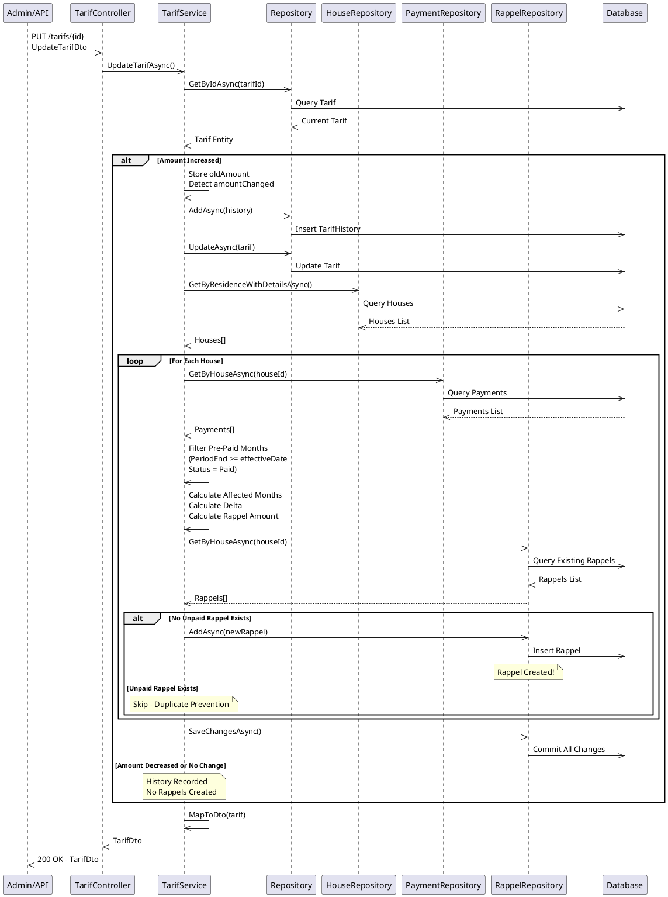
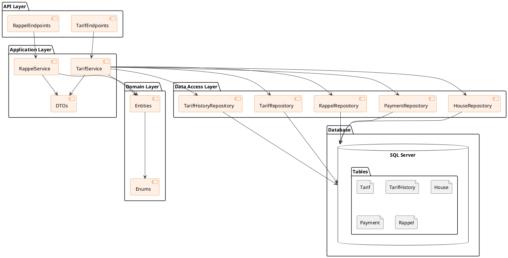
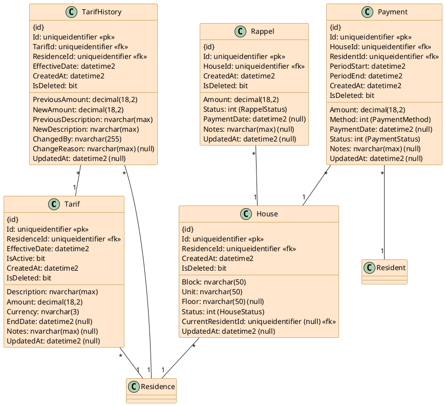

```plantuml
@startuml residence-services
!define SERVICE_COLOR #E6FFE6
!define INTERFACE_COLOR #F0E6FF

skinparam class {
    BackgroundColor SERVICE_COLOR
    BorderColor #00CC00
    ArrowColor #333333
}

interface ITarifService {
    + CreateTarifAsync(residenceId: Guid, dto: CreateTarifDto, userId: string): Task<TarifDto>
    + UpdateTarifAsync(residenceId: Guid, tarifId: Guid, dto: UpdateTarifDto, userId: string): Task<TarifDto>
    + GetTarifByIdAsync(tarifId: Guid): Task<TarifDto?>
    + GetTarifsByResidenceAsync(residenceId: Guid): Task<IEnumerable<TarifDto>>
    + GetCurrentTarifAsync(residenceId: Guid): Task<TarifDto?>
    + GetTarifHistoryAsync(tarifId: Guid): Task<IEnumerable<TarifHistoryDto>>
    + GetResidenceTarifHistoryAsync(residenceId: Guid): Task<IEnumerable<TarifHistoryDto>>
    + GetTarifHistoryByDateRangeAsync(residenceId: Guid, startDate: DateTime, endDate: DateTime): Task<IEnumerable<TarifHistoryDto>>
    + UpdateTarifHistoryAsync(residenceId: Guid, tarifId: Guid, historyId: Guid, dto: UpdateTarifHistoryDto, userId: string): Task<TarifHistoryDto>
    + DeleteTarifAsync(residenceId: Guid, tarifId: Guid): Task<bool>
}

interface IRappelService {
    + CreateRappelAsync(residenceId: Guid, dto: CreateRappelDto): Task<RappelDto>
    + GetRappelByIdAsync(id: Guid): Task<RappelDto>
    + UpdateRappelAsync(id: Guid, dto: UpdateRappelDto): Task<RappelDto>
    + DeleteRappelAsync(id: Guid): Task
    + GetRappelsByHouseAsync(houseId: Guid, pagination: PaginationDto): Task<PagedResultDto<RappelDto>>
    + GetRappelsByResidenceAsync(residenceId: Guid, pagination: PaginationDto): Task<PagedResultDto<RappelDto>>
}

interface ITarifRepository {
    + GetByIdAsync(id: Guid): Task<Tarif?>
    + GetCurrentTarifAsync(residenceId: Guid): Task<Tarif?>
    + GetTarifsByResidenceAsync(residenceId: Guid): Task<IEnumerable<Tarif>>
    + AddAsync(tarif: Tarif): Task<Tarif>
    + UpdateAsync(tarif: Tarif): Task
    + DeleteAsync(id: Guid): Task
}

interface ITarifHistoryRepository {
    + GetByIdAsync(id: Guid): Task<TarifHistory?>
    + GetHistoryByTarifIdAsync(tarifId: Guid): Task<IEnumerable<TarifHistory>>
    + GetHistoryByResidenceIdAsync(residenceId: Guid): Task<IEnumerable<TarifHistory>>
    + GetHistoryByDateRangeAsync(residenceId: Guid, startDate: DateTime, endDate: DateTime): Task<IEnumerable<TarifHistory>>
    + AddAsync(history: TarifHistory): Task<TarifHistory>
    + UpdateAsync(history: TarifHistory): Task
}

interface IHouseRepository {
    + GetByResidenceWithDetailsAsync(residenceId: Guid): Task<IEnumerable<House>>
    + GetByIdAsync(id: Guid): Task<House?>
}

interface IPaymentRepository {
    + GetByHouseAsync(houseId: Guid): Task<IEnumerable<Payment>>
}

interface IRappelRepository {
    + GetByHouseAsync(houseId: Guid): Task<IEnumerable<Rappel>>
    + AddAsync(rappel: Rappel): Task<Rappel>
    + SaveChangesAsync(): Task
}

class TarifService {
    - _tarifRepository: ITarifRepository
    - _tarifHistoryRepository: ITarifHistoryRepository
    - _residenceRepository: IResidenceRepository
    - _houseRepository: IHouseRepository
    - _paymentRepository: IPaymentRepository
    - _rappelRepository: IRappelRepository
    --
    + CreateTarifAsync(): Task<TarifDto>
    + UpdateTarifAsync(): Task<TarifDto>
    - DetectAndCreateRappelsAsync(): Task
    - MapToDto(): TarifDto
    - MapHistoryToDto(): TarifHistoryDto
}

class RappelService {
    - _rappelRepository: IRappelRepository
    - _houseRepository: IHouseRepository
    --
    + CreateRappelAsync(): Task<RappelDto>
    + GetRappelByIdAsync(): Task<RappelDto>
    + UpdateRappelAsync(): Task<RappelDto>
    + DeleteRappelAsync(): Task
    - MapToDto(): RappelDto
}

ITarifService <|.. TarifService
IRappelService <|.. RappelService

TarifService --> ITarifRepository
TarifService --> ITarifHistoryRepository
TarifService --> IHouseRepository
TarifService --> IPaymentRepository
TarifService --> IRappelRepository

RappelService --> IRappelRepository
RappelService --> IHouseRepository

@enduml
```

# UML Class Diagram - Residence Application

## Overview

This document provides comprehensive UML class diagrams for the Residence Management Application, focusing on the core domain entities, DTOs, services, and their relationships.

---

## 1. Domain Entities Class Diagram

### PlantUML Syntax



### Mermaid Alternative Syntax



---

## 2. DTOs (Data Transfer Objects) Class Diagram

### PlantUML Syntax



---

## 3. Services & Repositories Interface Diagram

### PlantUML Syntax



---

## 4. Rappel Detection Flow Diagram

### PlantUML Sequence Diagram



---

## 5. Component Diagram

### PlantUML Syntax



---

## 6. Key Relationships & Dependencies

### Entity Relationships Summary

| From | To | Type | Description |
|------|----|----|-------------|
| Tarif | Residence | Many-to-One | Each tariff belongs to one residence |
| Tarif | TarifHistory | One-to-Many | Each tariff can have multiple history records |
| House | Rappel | One-to-Many | Each house can have multiple rappels |
| House | Payment | One-to-Many | Each house receives multiple payments |
| Payment | Resident | Many-to-One | Each payment is from one resident |
| House | Resident | Many-to-One | Each house has one current resident |

### Service Dependencies

```
TarifService depends on:
├── ITarifRepository (tariff data access)
├── ITarifHistoryRepository (history tracking)
├── IResidenceRepository (validation)
├── IHouseRepository (rappel detection)
├── IPaymentRepository (pre-paid detection)
└── IRappelRepository (rappel creation)

RappelService depends on:
├── IRappelRepository (rappel data access)
└── IHouseRepository (house validation)
```

---

## 7. Data Flow Diagram

### Tariff Update with Rappel Detection

```
┌─────────────────────────────────────────────────────────────────┐
│                     TARIFF UPDATE FLOW                          │
└─────────────────────────────────────────────────────────────────┘

  1. Admin Request
     └─> PUT /api/residences/{residenceId}/tarifs/{tarifId}
         └─> UpdateTarifDto { amount: 120, effectiveDate: ... }

  2. Validation
     └─> Verify tariff exists
     └─> Verify belongs to residence

  3. Data Update
     └─> Save old amount (for comparison)
     └─> Update tariff amount
     └─> Create history record
     └─> Commit to database

  4. Rappel Detection (if amount increased)
     ├─> Query all houses in residence
     ├─> For each house:
     │   ├─> Get all payments
     │   ├─> Filter pre-paid (PeriodEnd >= effectiveDate, Status=Paid)
     │   ├─> Calculate affected months count
     │   ├─> Calculate delta (newAmount - oldAmount)
     │   ├─> Calculate rappelAmount (delta × months)
     │   ├─> Check for existing unpaid rappel
     │   └─> Create rappel if no duplicate
     └─> Commit all rappels to database

  5. Response
     └─> 200 OK - Updated TarifDto
     └─> Rappels auto-created in background
```

---

## 8. Database Schema Diagram

### PlantUML Syntax



---

## 9. Class Interaction for Rappel Detection

### Detailed Flow

```
┌─────────────────────────────────────────────────────────────────┐
│           RAPPEL DETECTION ALGORITHM - DETAILED FLOW            │
└─────────────────────────────────────────────────────────────────┘

INPUTS:
  ├─ residenceId: Guid
  ├─ oldTarif: Tarif { Amount = 100 }
  ├─ newTarif: Tarif { Amount = 120 }
  └─ effectiveDate: DateTime = "2024-02-01"

PROCESSING:

  1. RETRIEVE HOUSES
     └─ var houses = await _houseRepository
                        .GetByResidenceWithDetailsAsync(residenceId)
        Result: [House101, House102, House103, ...]

  2. FOR EACH HOUSE (LOOP)

     2.1 GET PAYMENTS
         └─ var payments = await _paymentRepository
                              .GetByHouseAsync(house.Id)
            Result: [Payment1, Payment2, ...]

     2.2 FILTER PRE-PAID MONTHS
         └─ var prePaidMonths = payments
              .Where(p => p.PeriodEnd >= effectiveDate &&
                          p.Status == PaymentStatus.Paid)

            Conditions:
              • PeriodEnd >= 2024-02-01 (covers future months)
              • Status = "Paid" (confirmed payment)

            Example Filter:
              Payment1: Jan-Mar (PeriodEnd: 2024-03-31) ✓
              Payment2: Oct 2023 (PeriodEnd: 2023-10-31) ✗
              Payment3: Feb (Status: Pending) ✗

     2.3 CHECK IF PRE-PAID EXISTS
         └─ if (!prePaidMonths.Any()) continue;

     2.4 CALCULATE AFFECTED MONTHS
         └─ var affectedMonthCount = 0;

            foreach (payment in prePaidMonths)
            {
              var paymentStart = payment.PeriodStart < effectiveDate 
                                 ? effectiveDate 
                                 : payment.PeriodStart;

              var monthsInPayment = 
                  ((payment.PeriodEnd.Year - paymentStart.Year) * 12) +
                  (payment.PeriodEnd.Month - paymentStart.Month) + 1;

              affectedMonthCount += monthsInPayment;
            }

            Example:
              Payment1: Jan-Mar 2024
                paymentStart = max(Jan-01, Feb-01) = Feb-01
                monthsInPayment = (0 * 12) + (2 - 2) + 1 = 1

              Payment2: Feb-Apr 2024
                monthsInPayment = (0 * 12) + (3 - 2) + 1 = 2

              Total affectedMonthCount = 3

     2.5 CALCULATE DELTA
         └─ var delta = newTarif.Amount - oldTarif.Amount
            delta = 120 - 100 = 20

     2.6 CHECK IF RAPPEL SHOULD BE CREATED
         └─ if (delta > 0 && affectedMonthCount > 0)
            {
              // Proceed to create rappel
            }

            Conditions:
              ✓ delta = 20 > 0 (tariff increased)
              ✓ affectedMonthCount = 3 > 0 (affected months exist)

     2.7 CALCULATE RAPPEL AMOUNT
         └─ var rappelAmount = delta * affectedMonthCount
            rappelAmount = 20 * 3 = 60

     2.8 CHECK DUPLICATE PREVENTION
         └─ var existingRappels = await _rappelRepository
                                     .GetByHouseAsync(house.Id)
            var hasUnpaidRappel = existingRappels
                                    .Any(r => r.Status == RappelStatus.Unpaid)

            if (hasUnpaidRappel)
              continue; // Skip this house - prevent duplicate

     2.9 CREATE RAPPEL RECORD
         └─ var rappel = new Rappel
            {
              HouseId = house.Id,
              Amount = 60,
              Status = RappelStatus.Unpaid,
              Notes = "Rappel créé suite à l'augmentation du tarif du 01/02/2024. " +
                      "Ancien tarif: 100 USD, Nouveau tarif: 120 USD. " +
                      "Nombre de mois pré-payés affectés: 3"
            };

            await _rappelRepository.AddAsync(rappel);

  3. SAVE ALL CHANGES
     └─ await _rappelRepository.SaveChangesAsync();
        (Commits all rappel inserts in one transaction)

OUTPUTS:
  ├─ Rappel created for House101: Amount = 60
  ├─ Rappel created for House102: Amount = 40 (if 2 months affected)
  ├─ No rappel for House103 (no pre-paid months)
  └─ All changes persisted to database
```

---

## 10. Usage Examples

### Creating Tariff with Rappel Detection

```csharp
// API Call
PUT /api/residences/550e8400-e29b-41d4-a716-446655440000/tarifs/660e8400-e29b-41d4-a716-446655440000
Content-Type: application/json

{
  "amount": 120.00,
  "effectiveDate": "2024-02-01T00:00:00Z",
  "changeReason": "Annual adjustment"
}

// Service Call
var result = await tarifService.UpdateTarifAsync(
    residenceId: Guid.Parse("550e8400-e29b-41d4-a716-446655440000"),
    tarifId: Guid.Parse("660e8400-e29b-41d4-a716-446655440000"),
    dto: new UpdateTarifDto 
    { 
        Amount = 120.00m,
        EffectiveDate = new DateTime(2024, 2, 1),
        ChangeReason = "Annual adjustment"
    },
    userId: "admin-user-123"
);

// Expected Response
{
  "id": "660e8400-e29b-41d4-a716-446655440000",
  "residenceId": "550e8400-e29b-41d4-a716-446655440000",
  "amount": 120.00,
  "effectiveDate": "2024-02-01T00:00:00Z",
  "isActive": true
  // Behind the scenes: Rappels created automatically for affected houses
}
```

---

## 11. Architecture Patterns

### Patterns Used

1. **Repository Pattern**
   - Data access abstraction through interfaces
   - Loose coupling between services and data layer

2. **Service Layer Pattern**
   - Business logic centralized in services
   - DTOs for API contracts

3. **Dependency Injection**
   - Constructor injection for loose coupling
   - Interface-based dependencies

4. **Entity Framework Core Pattern**
   - ORM for database operations
   - Navigation properties for relationships

5. **Domain-Driven Design (DDD)**
   - Rich domain entities
   - Aggregate roots (Tarif, House, Payment)

---

## 12. Testing Considerations

### Unit Test Structure

```csharp
public class TarifServiceTests
{
    [Fact]
    public async Task UpdateTarif_WithAmountIncrease_CreatesRappels()
    {
        // Arrange
        var residenceId = Guid.NewGuid();
        var tarifId = Guid.NewGuid();
        var houseId = Guid.NewGuid();

        var dto = new UpdateTarifDto 
        { 
            Amount = 120m,
            EffectiveDate = DateTime.UtcNow 
        };

        // Mock repositories
        var tarifRepoMock = new Mock<ITarifRepository>();
        var houseRepoMock = new Mock<IHouseRepository>();
        var paymentRepoMock = new Mock<IPaymentRepository>();
        var rappelRepoMock = new Mock<IRappelRepository>();

        // Act
        var result = await service.UpdateTarifAsync(residenceId, tarifId, dto, "user");

        // Assert
        rappelRepoMock.Verify(x => x.AddAsync(It.IsAny<Rappel>()), Times.Once);
        Assert.Equal(120m, result.Amount);
    }
}
```

---

## 13. Performance Notes

### Query Optimization

```sql
-- Indexes for pre-paid payment detection
CREATE INDEX IDX_Payment_PeriodEnd_Status 
  ON Payment(PeriodEnd, Status)
  WHERE IsDeleted = 0;

-- Index for rappel duplicate prevention
CREATE INDEX IDX_Rappel_HouseId_Status 
  ON Rappel(HouseId, Status)
  WHERE IsDeleted = 0;

-- Index for house in residence lookup
CREATE INDEX IDX_House_ResidenceId 
  ON House(ResidenceId)
  WHERE IsDeleted = 0;
```

---

## Summary

This UML documentation provides:

✅ **Domain Entity Relationships** - Complete class hierarchy and data model  
✅ **Service Architecture** - Interface contracts and dependencies  
✅ **Data Flow** - Rappel detection algorithm and processing steps  
✅ **Component Diagram** - Layered architecture overview  
✅ **Database Schema** - Physical data model  
✅ **Integration Points** - How components interact  
✅ **Usage Examples** - Practical implementation patterns  
✅ **Performance Considerations** - Optimization strategies  

The architecture supports:
- **Automatic rappel detection** when tariffs are updated
- **Duplicate prevention** with comprehensive business rules
- **Audit trails** through history records
- **Scalable design** with proper separation of concerns
- **Testability** through interface-based dependencies
