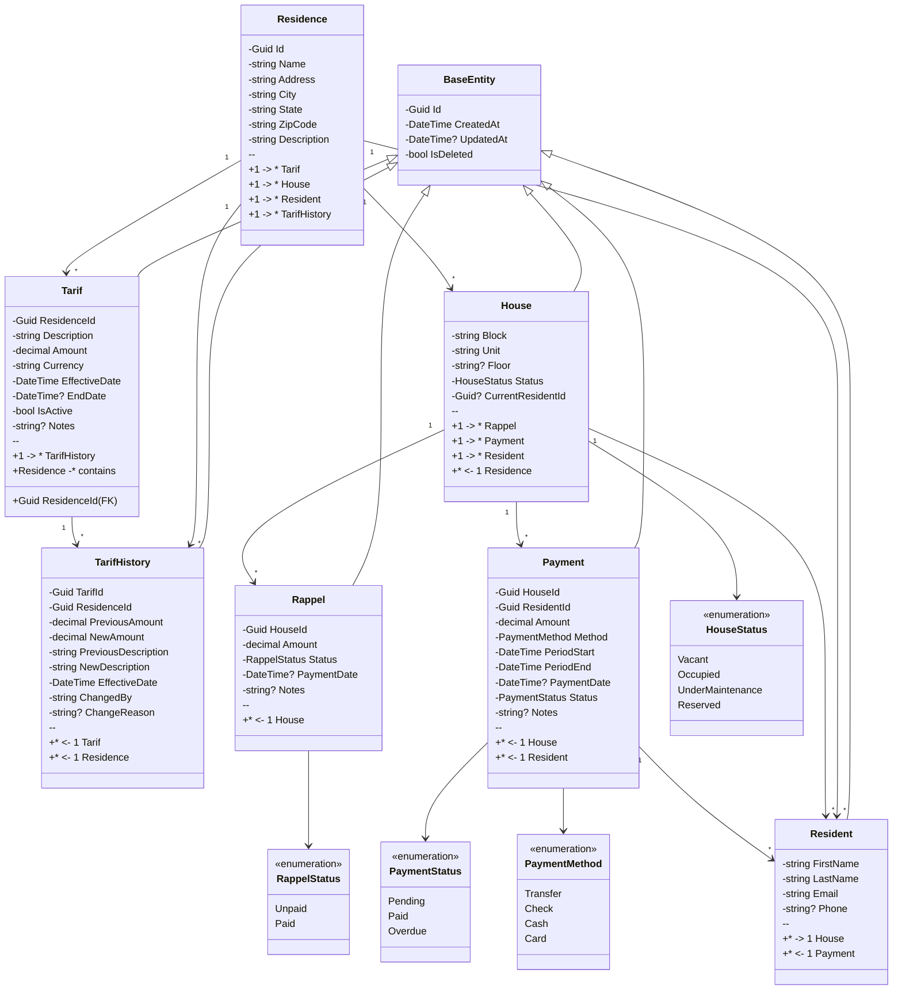
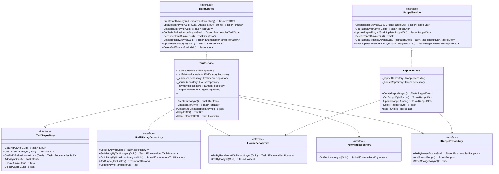
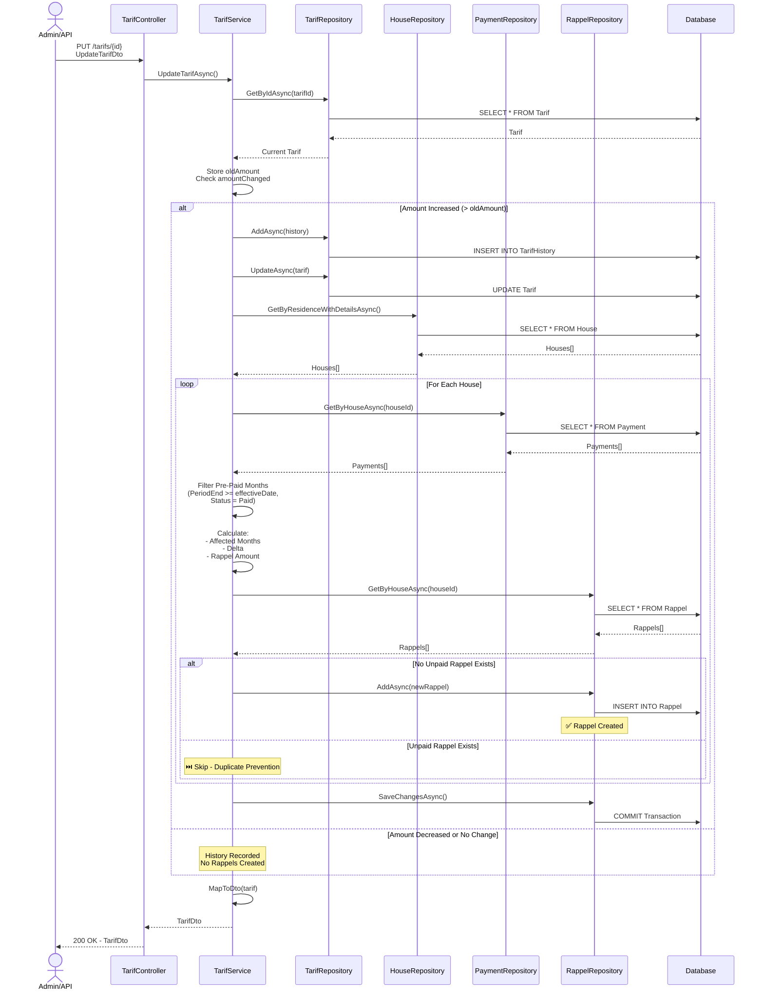
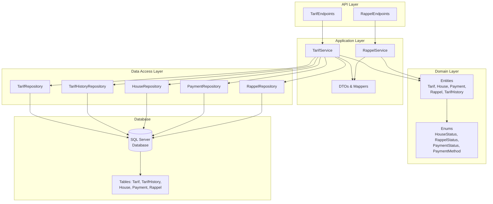
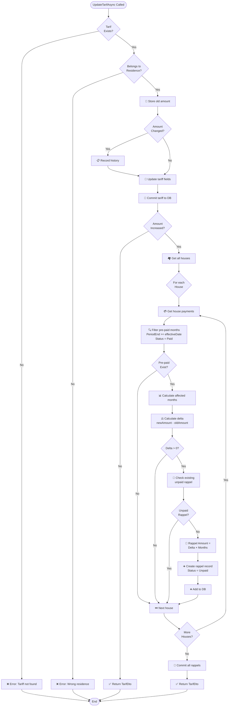
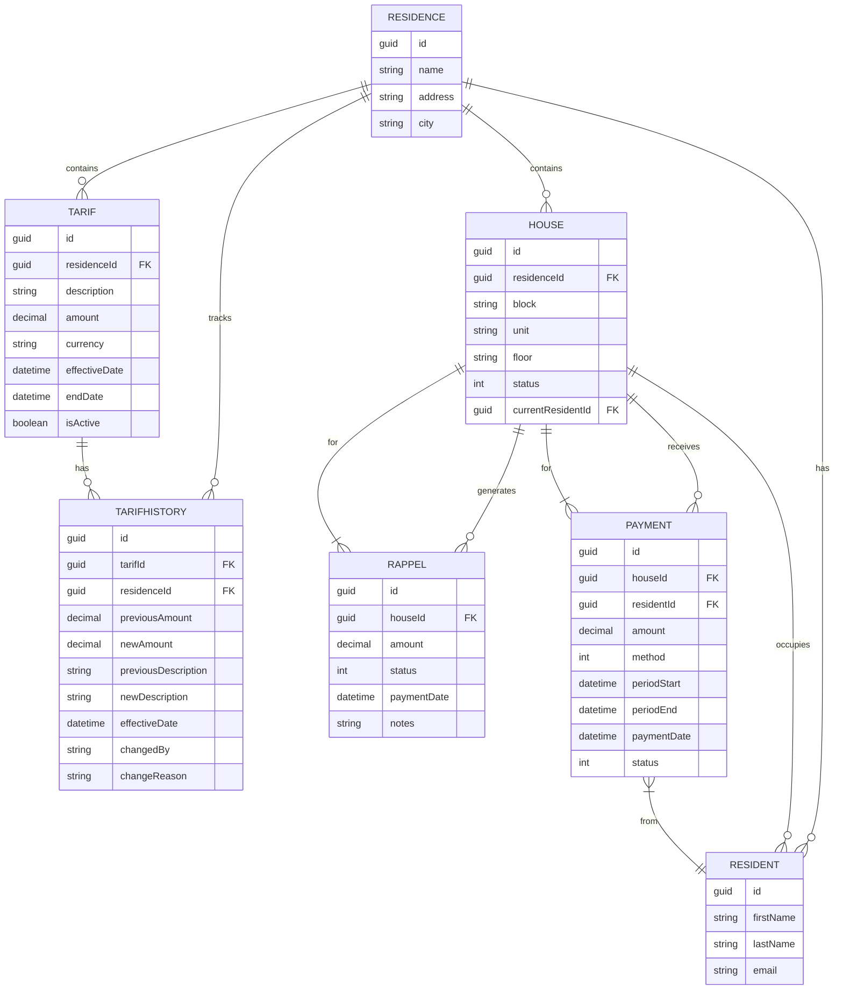
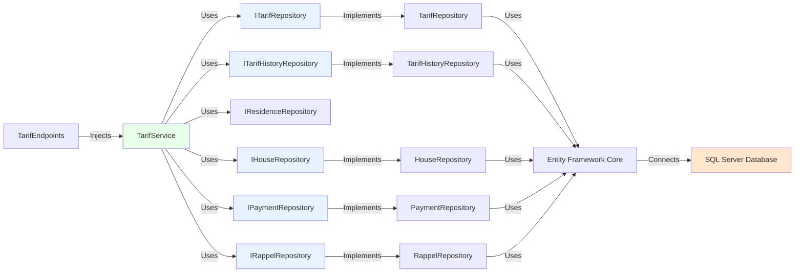
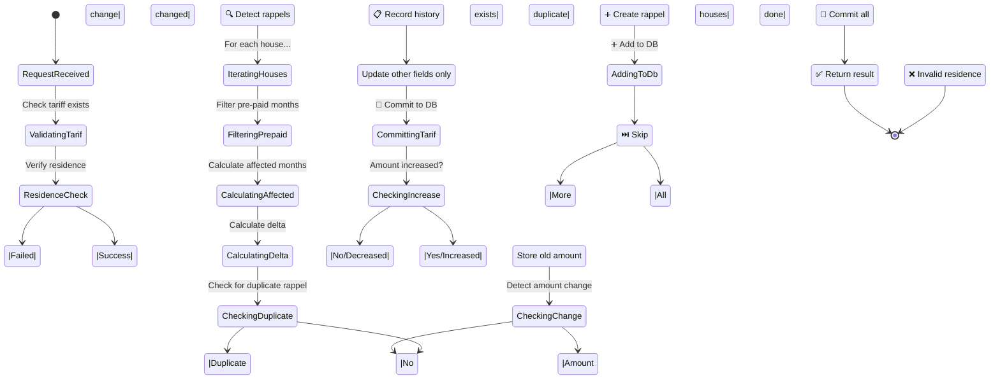
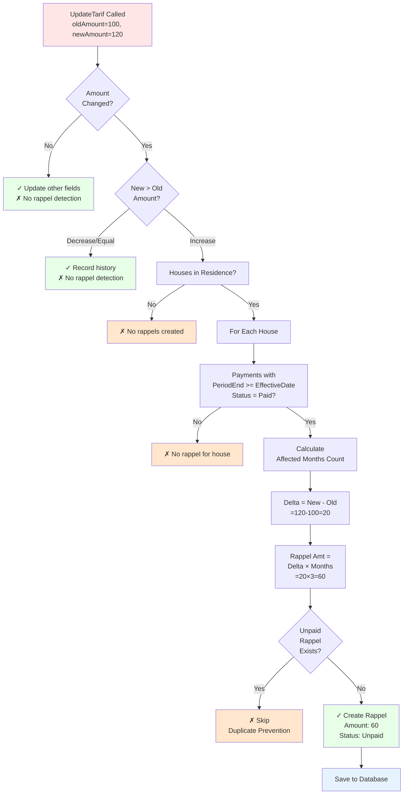
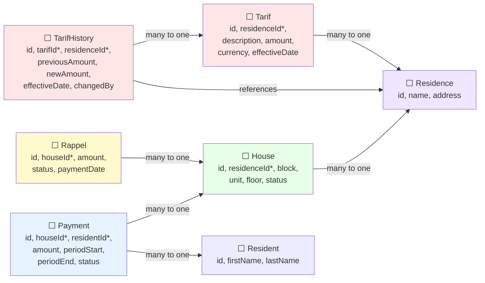

# UML Diagrams - Visual Guide (Mermaid Format)

## 1. Domain Entities Class Diagram

---

## 2. Service & Repository Architecture

---

## 3. Rappel Detection Sequence Diagram

---

## 4. Component Architecture

---

## 5. Rappel Detection Algorithm Flow

---

## 6. Data Entity Relationships

---

## 7. Dependency Injection Graph

---

## 8. Update Tariff Processing States

---

## 9. Rappel Creation Decision Tree

---

## 10. Database Schema Relationships

---

## Summary

These Mermaid diagrams provide:

✅ **Complete class hierarchies** with all properties and methods  
✅ **Service architecture** showing interfaces and implementations  
✅ **Sequence diagrams** detailing the rappel detection flow  
✅ **Entity relationships** in ER diagram format  
✅ **Processing flow charts** for complex business logic  
✅ **State machines** showing system state transitions  
✅ **Decision trees** for rappel creation logic  
✅ **Component architecture** with layered design  

You can copy these Mermaid diagrams directly into:
- GitHub README files (rendered automatically)
- Markdown tools that support Mermaid
- Mermaid Live Editor: https://mermaid.live/
- VS Code with Markdown Preview Enhanced extension
